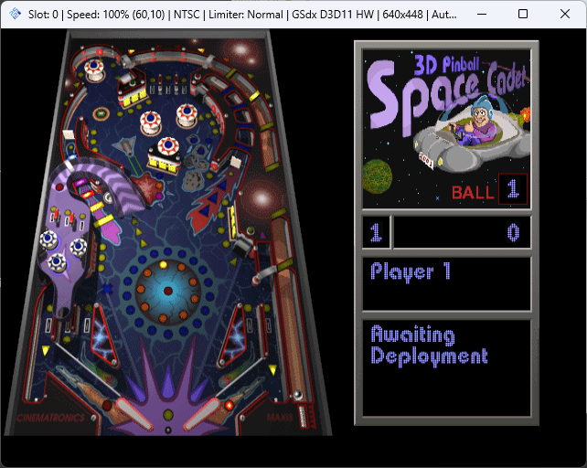

# 3D Pinball - Space Cadet for PS2

Port of 3D Pinball - Space Cadet to the PlayStation 2, based on the [decompilation project](https://github.com/k4zmu2a/SpaceCadetPinball)

Built with [PS2SDK](https://github.com/ps2dev/ps2sdk)

Game data from 3D Pinball Space Cadet (Windows 95 Plus, Windows XP...) or from Full Tilt! Pinball ("CADET" table) must be placed in `mass:/APPS/3DPINBALL` ("mass" being USB storage)
